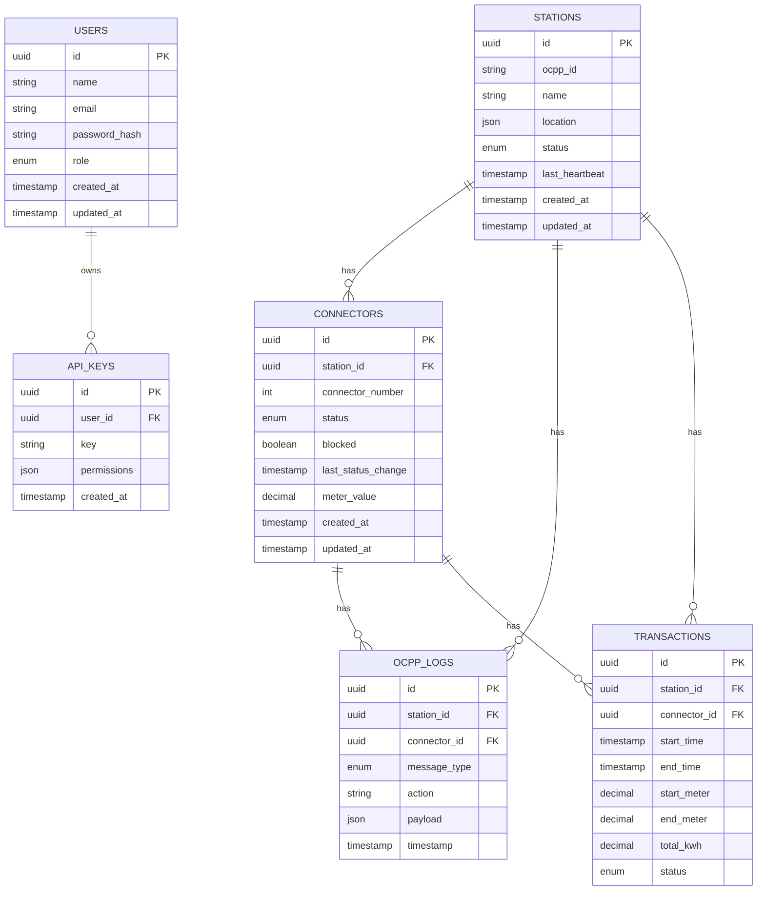

# OCPP Gateway Project Plan

## 1. Flow Plan

1. **Station Boot**
   - Station connects via WebSocket
   - Sends `BootNotification`
   - Gateway stores station in database
   - All connectors initialized with `Unknown` status

2. **Connector Status Updates**
   - Station sends `StatusNotification`
   - Gateway updates connector status in DB and Redis cache
   - Dashboard and partner systems receive real-time updates

3. **Meter Data**
   - Station sends `MeterValues`
   - Gateway logs meter reading into database

4. **Transactions**
   - `StartTransaction` → Gateway records start time & meter reading
   - `StopTransaction` → Gateway records end time & calculates total kWh

5. **Control Actions**
   - Admin or partner triggers "Block Connector"
   - Gateway sends `ChangeAvailability` command to station
   - Station updates status
   - Gateway logs the change

6. **Third-Party Access**
   - Partner API allows querying connector availability
   - Real-time WebSocket feed for partner systems

---

## 2. Development Stages

### Phase 1 — Core OCPP Gateway
- Implement WebSocket server to handle OCPP 1.6J messages
- Support BootNotification, StatusNotification, and MeterValues
- Store station and connector data in PostgreSQL

### Phase 2 — Logging & Transactions
- Store all OCPP messages in `ocpp_logs`
- Handle StartTransaction and StopTransaction events
- Link transactions to connectors and stations

### Phase 3 — API & Control
- Build REST API for stations, connectors, and logs
- Implement block/unblock feature via `ChangeAvailability`
- Secure API with JWT or API key authentication

### Phase 4 — Real-Time Dashboard
- Build React-based dashboard with Tailwind CSS
- Show real-time connector statuses
- Display transaction history and logs

### Phase 5 — Partner Integration
- Provide API keys for third-party access
- Partner-specific endpoints and WebSocket feeds
- Limit data visibility per partner permissions

### Phase 6 — Scaling & Security
- Implement Redis caching for real-time lookups
- Enable horizontal scaling with load balancing
- Use TLS/WSS for secure connections

---

## 3. Database Schema (Mermaid ER Diagram)

